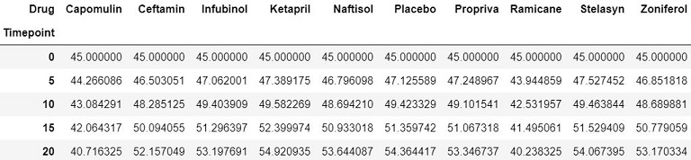

# Analysis for Mouse Treatment (Pymaceuticals, Inc.) 

Pymaceuticals Inc. is a fictitious burgeoning pharmaceutical company based out of San Diego, CA. It specializes in drub-based, anti-cancer pharmaceuticals. In their most recent efforts, they've since begun screening for potential treatments to squamous cell carcinoma (SCC), a commonly occurring form of skin cancer. 

I have been given access to the complete data from their most recent animal study. In this study, 250 mice were treated through 10 drug regimes over the course of 45 days. Their physiological responses were then monitored over the course of that time.

In this project, my main objective is to analyze the data to show how 4 drug treatements (Capomulin, Infubinol, Ketapril, and Placebo) regarding their impact on the mice. 

The two datasets used are:

 * [Mouse_Drug_Data](data/mouse_drug_data.csv) showing the Mouse ID and the corresponding drug
 * [Clinical_Trial_Data](data/clinicaltrial_data.csv) showing the drug impact over the 45 days by Mouse

## Technologies Used
   * Pandas
   * Numpy
   * Matplotlib
   
## Summary of Main Steps and relevant Outputs
  1. **Loaded CSV Files and merged them into a single dataset**

  2. **Tumor Response to Treatment Analysis:** 
  
    * Analysis of Mean of Tumor Volume by Drug throughout the 45 days. Only showing the first 5 results
  
     
     
    * Analysis of Standard Error of Tumor Volume by Drug throughout the 45 days. Only showing the first 5 results
  
     
     

  3. **Player Count:**  Finding a unique count of Players as some players had more than 1 purchase
  
  

  4. **Overall Purchasing Analysis:** Doing an overall purchasing Analysis
  
  

  5. **Gender Demographics:** Finding Count and Percentage of Players by Gender 
  
  

  6. **Purchasing Analysis by Gender:** Doing an overall purchasing Analysis by Gender
  
  

  7. **Age Demographics:** After establishing bins for the ages of playes, I came up with the below output
  
  

  8. **Purchasing Analysis by Age Group:** Leveraging Bins created, I came up with the following outputs
  
  

  9. **Top Spenders:** Identifying the the top 5 spenders and sorting in descending order
  
  

  10. **Most Popular Items:** Identifying the 5 most popular items by purchase count
  
  

  11. **Most Profitable Items:** Identifying the 5 most profitable items by total purchase value
  
  

## Conclusions
Based on the analysis, I see 3 main insights, which are listed at: [Observable_Trends.docx](Observable_Trends.docx).

To do this you are tasked with:

* Creating a scatter plot that shows how the tumor volume changes over time for each treatment.
* Creating a scatter plot that shows how the number of [metastatic](https://en.wikipedia.org/wiki/Metastasis) (cancer spreading) sites changes over time for each treatment.
* Creating a scatter plot that shows the number of mice still alive through the course of treatment (Survival Rate)
* Creating a bar graph that compares the total % tumor volume change for each drug across the full 45 days.

As final considerations:

* You must use the Pandas Library and the Jupyter Notebook.
* You must use the Matplotlib library.
* You must include a written description of three observable trends based on the data.
* You must use proper labeling of your plots, including aspects like: Plot Titles, Axes Labels, Legend Labels, X and Y Axis Limits, etc.
* Your scatter plots must include [error bars](https://en.wikipedia.org/wiki/Error_bar). This will allow the company to account for variability between mice. You may want to look into [`pandas.DataFrame.sem`](http://pandas.pydata.org/pandas-docs/stable/generated/pandas.DataFrame.sem.html) for ideas on how to calculate this.
* Remember when making your plots to consider aesthetics!
  * Your legends should not be overlaid on top of any data.
  * Your bar graph should indicate tumor growth as red and tumor reduction as green.
    It should also include a label with the percentage change for each bar. You may want to consult this [tutorial](http://composition.al/blog/2015/11/29/a-better-way-to-add-labels-to-bar-charts-with-matplotlib/) for relevant code snippets.
* See [Starter Workbook](Pymaceuticals/pymaceuticals_starter.ipynb) for a reference on expected format. (Note: For this example, you are not required to match the tables or data frames included. Your only goal is to build the scatter plots and bar graphs. Consider the tables to be potential clues, but feel free to approach this problem, however, you like.)

## Hints and Considerations

* Be warned: These are very challenging tasks. Be patient with yourself as you trudge through these problems. They will take time and there is no shame in fumbling along the way. Data visualization is equal parts exploration, equal parts resolution.

* You have been provided a starter notebook. Use the code comments as a **guideline** of steps you may wish to follow as you complete the assignment. You do not have to follow them step-for-step. Do not get bogged down in trying to interpret and accomplish each step.

* Feel encouraged to constantly refer to Stack Overflow and the Pandas Documentation. These are needed tools in every data analyst's arsenal.

* Don't get bogged down in small details. Always focus on the big picture. If you can't figure out how to get a label to show up correctly, come back to it. Focus on getting the core skeleton of your notebook complete. You can always re-visit old problems.

* Remember: There are many ways to skin a cat, and similarly there are many ways to approach a data problem. The key throughout, however, is to break up your task into micro tasks. Try answering questions like: "How does my Data Frame need to be structured for me to have the right X and Y axis?" "How do I build a basic scatter plot?" "How do I add a label to that scatter plot?" "Where would the labels for that scatter plot come from?". Again! Don't let the magnitude of a programming task scare you off. Ultimately, every programming problem boils down to a handful of smaller, bite-sized tasks.

* Get help when you need it! There is never any shame in asking. But as always, ask a _specific_ question. You'll never get a great answer to: "I'm lost." Good luck!

## Copyright

Data Boot Camp © 2018. All Rights Reserved.
