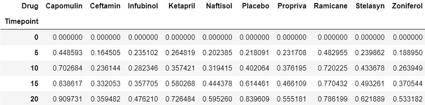
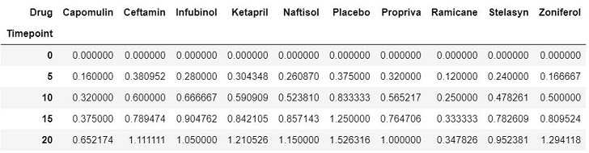
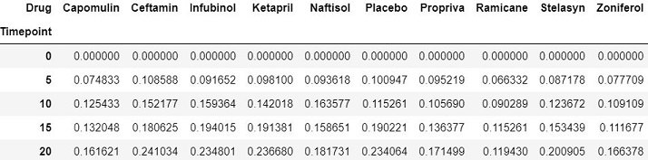
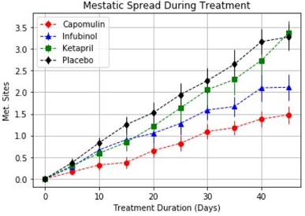
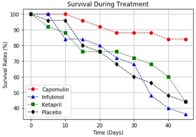
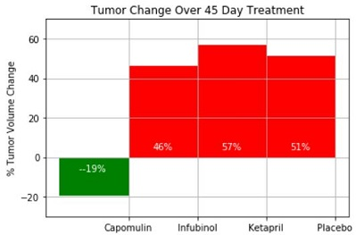

# Analysis for Mouse Treatment (Pymaceuticals, Inc.) 

Pymaceuticals Inc. is a fictitious burgeoning pharmaceutical company based out of San Diego, CA. It specializes in drub-based, anti-cancer pharmaceuticals. In their most recent efforts, they've since begun screening for potential treatments to squamous cell carcinoma (SCC), a commonly occurring form of skin cancer. 

I have been given access to the complete data from their most recent animal study. In this study, 250 mice were treated through 10 drug regimes over the course of 45 days. Their physiological responses were then monitored over the course of that time.

In this project, my main objective is to analyze the data for 4 drug treatements (Capomulin, Infubinol, Ketapril, and Placebo) regarding their impact on the mice. 

The two datasets used are:

 * [Mouse_Drug_Data](data/mouse_drug_data.csv) showing the Mouse ID and the corresponding drug
 * [Clinical_Trial_Data](data/clinicaltrial_data.csv) showing the drug impact over the 45 days by Mouse

## Technologies Used
   * Pandas
   * Numpy
   * Matplotlib
   
## Summary of Main Steps and relevant Outputs
  1. **Loaded CSV Files and merged them into a single dataset**

  2. **Tumor Response to Treatment Analysis:** 
  
   * Analysis of Mean of Tumor Volume by Drug throughout the 45 days. Only showing the first 5 results
   
   
   
   * Analysis of Standard Error of Tumor Volume by Drug throughout the 45 days. Only showing the first 5 results
   
   
   
   * Error Bar Plots of Mean and Standard Errors for Capomulin, Infubinol, Ketapril, and Placebo
   
   
   
  3. **Metastatic Response to Treatment:** 
  
   * Analysis of Mean of Mestatic Sites by Drug throughout the 45 days. Only showing the first 5 results
   
   
   
   * Analysis of Standard Error of Metastatic Sites by Drug throughout the 45 days. Only showing the first 5 results
   
   
   
   * Error Bar Plots of Mean and Standard Errors for Capomulin, Infubinol, Ketapril, and Placebo
   
   
   
  4. **Survival Rates:** 
  
   * Analysis of Count of Mice by Drug throughout the 45 days. Only showing the first 5 results
   
   
   
   * After finding Survival Rates Percent at different time (Count of Mice at different points divided by Beginning Count of Mice), I am      plotting Rates for Capomulin, Infubinol, Ketapril, and Placebo
   
   
   
  5. **Overall Summary Graph:** 
  
   * Plotting the Percent Change of the Mean Tumor over the course of the treatment
   
   
   
## Conclusions
Based on the analysis, I see 3 main insights, which are listed at: [Observable_Trends.docx](Observable_Trends.docx).
